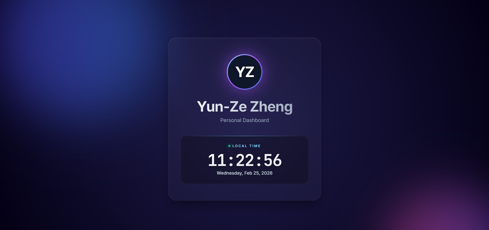

# Yun-Ze Zheng - Personal Page

**[🔥 Live Demo Website](https://g114064015lab.github.io/0225DRL_DIC1/)**

This repository contains a personal single-page web application built with a modern, dynamic, and premium aesthetic.

## 🚀 Features

- **Premium Design Aesthetics**: Features a sleek dark mode with glassmorphism components and smooth hover interactions. 
- **Dynamic Animations**: Includes soft glowing ambient orbs in the background and a pulsing avatar ring.
- **Top-tier Typography**: Integrates Google Fonts (`Inter` for reading text and `JetBrains Mono` for tabular data) for maximum readability and style.
- **Real-Time Local Clock**: A dynamic JavaScript engine that tracks and prints the exact real-time locally synchronized with the browser. 
- **Responsive Layout**: Designed to look great on both desktop and mobile devices.

## 🛠️ Development Log (2026-02-25)

The following tasks were completed today:

1. **Initial Setup & V1 Build**:
   - Created `index.html` structure with the core personal details (Name: Yun-Ze Zheng).
   - Designed a polished user interface integrating complex CSS animations directly.
   - Programmed the initial javascript snippet to handle the clock logic.
   - Initialized the local system environment with `git` to prepare for version control.
   - Committed the initial structure and pushed it to the main branch via remote GitHub URL.

2. **Code Refactoring**:
   - Extracted all embedded CSS stylings from `index.html` into a dedicated `.css` stylesheet (`style.css`).
   - Re-linked the HTML structure to the independent stylesheet for cleaner maintenance.
   - Pushed the refactoring modifications to GitHub.

3. **Bug Fixes**:
   - **Resolved Clock Lag**: Adjusted the JavaScript logic from utilizing fixed system times statically to fetching real-time precise measurements (`new Date()`) incrementally. This ensures the user continuously sees accurate, real-time seconds ticking.
   - Committed and pushed this critical fix to GitHub.

## 📂 File Structure

- `index.html` - The core application document and structure.
- `style.css` - Custom styling library governing page aesthetics, animations, and responsiveness.
- `README.md` - Contextual documentation containing the project history and features.
